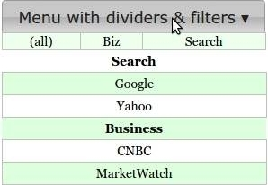

Parameters specifications for menus
===================================

`Show me the menu demo <http://www.menuoptions.org/examples/MenusBottom.html>`_

| 

Parameter list for menus
------------------------

.. csv-table:: Paramters for menus
    :header: Parameter,Type,Allowable Values,Default,Required
    :widths: 22,22,35,35,25

    ColumnCount,integer,positive integer,1,false
    Data,JSON object,"array, object or array of objects",none,true
    Filters, array of objects,"{'str':'str'} or {'str':'RegExp'}", none, false
    MenuOptionsType,string,'Select' or 'Navigate','Select',false
    ShowAt,string,'Bottom' or 'Right','Bottom',false
    ShowDownArrow,string, 'None or <color>','black',false 
    Sort,array of strings,"['alpha'|'num', 'desc'|'asc']","['alpha','asc']",false
    Width,integer,positive integer,width of parent,false

Parameters explained for menus
------------------------------

ColumnCount
^^^^^^^^^^^
   options: **positive integer**

   MenuOptions defaults to a single column. To show have more than one 
   column, use the ColumnCount parameter. 

Data
^^^^
    options: **{}, [ [], [], ...], or [ {}, {}, ... ]** 

    MenuOptions menus accept the following in `Data`

    1. a single object
    #. a array of objects
    #. an array of arrays

Filters
^^^^^^^
    options: **[ { 'text : 'text' }, ...] or [ {'text': 'RegExp'}, ...]**

    Filters enable mouseover filering of menu items
    You can filter by plain text or by regular expression
    Here is an example of using Filters with a RegExp
    (`Filters demo <http://www.menuoptions.org/examples/Dividers.html>`_ )

.. code-block:: javascript

    'Filters': [{ 'Biz' : '^(CNBC|MarketWatch)'}, {'Search' :'^(Google|Yahoo)'} ],

MenuOptionsType
^^^^^^^^^^^^^^^
    options: **'Select' or 'Navigate'**

    MenuOptions defaults to "Select". To create a menu drop down, call 
    menuoptions with MenuOptionsType = "Navigate"

.. code-block:: javascript

    'MenuOptionsType': 'Navigate'

ShowAt
^^^^^^
    options: **'bottom' or 'right'**  

    MenuOptions accepts a string to tell it where to display the menu ::

    "Bottom" means that the menu will appear underneath
    "Right" means that the menu will appear to the right

ShowDownArrow
^^^^^^^^^^^^^
     options: **None or <color>**

     ShowDownArrow defaults to "black:, meaning a down arrow will automatically 
     be appended to the end of a menu drop down in the color black. 
     Set ShowDownArrow to "None" if you would rather not see this arrow.
     Set ShowDownArrow to "silver" if you would like the arrow color to be silver.

.. code-block:: javascript

    'ShowDownArrow': 'silver'

Sort
^^^^
    options: **['alpha' or 'num', 'desc' or 'asc']**

     Setting the property to an empty array will cause a Data array 
     (or array of objects) to be displayed in the original order.
     With no sort, a single object will be displayed in random order.

Width
^^^^^
   options: **positive integer**

   MenuOptions will try to match the width of the parent element (it may be
   wider if the contents cannot fit). The Width parameter allows the user to 
   override the default width. 

