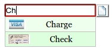

Parameters specifications for select lists
==========================================

`Show me the select demo <http://menuoptions.org/examples/SelectWithImages.html>`_

Parameter list for select list
-------------------------------

.. csv-table:: Paramters for select list
    :header: Parameter,Type,Allowable Values,Default,Required
    :widths: 22,22,35,35,25

    `ClearBtn`_ ,boolean,"true or false",true,false
    `ColumnCount`_,integer,"positive integer",1,false
    `Data <SelectParams.html#id3>`_ ,JSON object, (see Data section below), none, true
    `DataKeyNames`_, object,(see DataKeyNames section below), none, false
    `DisableHiLiting`_,boolean, "true or false", true, false
    `Filters`_, array of objects,"{'str':'str'} or {'str':'RegExp'}", none, false
    `Height`_,integer,positive integer, height of dropdown, false
    `InitialValue`_,object,{'ky'|'val': <value>}, {}, false
    `MenuOptionsType`_,string,'Select' or 'Navigate' or 'Rocker','Select',false
    `NotInListWarns`_,boolean,'true or false',true,false
    `onSelect`_, function,function(),none,false
    `PlaceHolder`_,<deleted>,<as of v1.6.1>,--,--
    `SelectOnly`_,boolean,"true or false",false,false
    `ShowAt`_,string,'Bottom' or 'Right','Bottom',false
    `Sort`_,array of strings,"['alpha'|'num', 'desc'|'asc']","['alpha','asc']",false
    TriggerEvent, <deleted>,<as of v1.5.1>,--,--
    `UseValueForKey`_,boolean,"true or false",false,false
    `Width`_,integer,positive integer, width of dropdown, false

Parameters explained for MenuOption select
------------------------------------------

.. _ClearBtn:

ClearBtn
~~~~~~~~
    options: **true or false**

    ClearBtn instructs MenuOptions to place a clear button to the right
    of the <input> element. It will clear that <input> element when clicked
    and cause the drop down list to appear.

.. _ColumnCount:

ColumnCount
~~~~~~~~~~~
   options: **positive integer**

   MenuOptions defaults to a single column. To show have more than one 
   column, use the ColumnCount parameter. 

Data
~~~~

    options: **[] or [ [], [], ...], {} or [ {}, {}, ... ]** 

    MenuOptions accepts the following in `Data`

    1. an array
            ["Jan","Feb","Mar"...]
    2. an array of arrays
           [["Jan","Feb","Mar"],["Apr","Jun","Jul"]...]
    3. a single multikey object
           { 1:"Jan", 2:"Feb",...}
    4. an array of multikey or single key objects 
           single key [{1:"Jan"},{2:"Feb"}...]

           multikey [{1:"Jan",2:"Feb"},{3:"Mar", 4:"Apr"}...]
    5. an array of multikey objects where keys are specifed and extracted

Notes: 
    1. Use arrays when you want the `menu_opt_key <FAQ.html#what-is-the-menu-opt-key>`_ to equal the displayed text, e.g., when using US State abbreviations. So the display would be 'AL' (for Alabama) and 'AL' would be stored in the `menu_opt_key <FAQ.html#what-is-the-menu-opt-key>`_
    2. Use objects  when you want to save a code in `menu_opt_key <FAQ.html#what-is-the-menu-opt-key>`_ For example, if you want to display 'January' but save the code 1 in the `menu_opt_key <FAQ.html#what-is-the-menu-opt-key>`_ (and later save that code in a database or other persistent storage).

.. _DataKeyNames:

DataKeyNames
~~~~~~~~~~~~

    options: **{ "key": <key name>, "value": <value name> }** 

    ``DataKeyNames`` allows you to utilize `Data <SelectParams.html#id3>`_ that has extra, unneeded data,
    only picking out the key and value fields that you specify.

    Below is the code used in `Quick start select list <http://menuoptions.org/examples/QuickStartSelect.html?custom_key_names>`_ 

.. code-block:: javascript
    :emphasize-lines: 18

    var data = [{"mon_num":1, "mon_name":"January", "junk_key":"junk_val"}, 
                {"mon_num":2, "mon_name":"February", "junk_key":"junk_val"}, 
                {"mon_num":3, "mon_name":"March", "junk_key":"junk_val"},
                {"mon_num":4, "mon_name":"April", "junk_key":"junk_val"},
                {"mon_num":5, "mon_name":"May", "junk_key":"junk_val"},
                {"mon_num":6, "mon_name":"June", "junk_key":"junk_val"}, 
                {"mon_num":7, "mon_name":"July", "junk_key":"junk_val"},
                {"mon_num":8, "mon_name":"August", "junk_key":"junk_val"},
                {"mon_num":9, "mon_name":"September", "junk_key":"junk_val"}, 
                {"mon_num":10, "mon_name":"October", "junk_key":"junk_val"}, 
                {"mon_num":11, "mon_name":"November", "junk_key":"junk_val"},
                {"mon_num":12, "mon_name":"December", "junk_key":"junk_val"}];
    $('input#selecttest').menuoptions({ 
        "Data": data,
        "onSelect": function(mo, data) { 
            console.log(mo, data.newVal, data.newCode, data.type );  
        }, 
        "DataKeyNames" : { "key": "mon_num", "value": "mon_name" },
        "ClearBtn": true,
        "InitialValue": { 'val': 'December'},
        "ShowAt": 'bottom',
        "Sort": []
    });  
    $('input#scrolltest').menuoptions({ 

Notes: 
    1. ``DataKeyNames`` requires that `Data <SelectParams.html#id3>`_ be an array of objects **[ {}, {}, ... ]**

.. _DisableHiLiting:

DisableHiLiting
~~~~~~~~~~~~~~~
    options: **true or false**

    When using autocomplete, if the user typed text does not match a `whole` select item,
    the border will be set to red. Once there is a match, the border returns to 
    its default color. Set to false to enable this feature. 
    
Notes: 
    1. Highlighing only restores previous styling if you set <input> elements border-color and border-width. If the <input> element inherits its CSS properties, they will not be restored to their original state (to avoid this scenario, set DisableHiLiting to true)
    2. To avoid conflicts with the <input> type=search, it is recommended to use <input> type=text when using MenuOptions highlighting.

.. _Filters:

Filters
~~~~~~~
    options: **[ { 'text : 'text' }, ...] or [ {'text': 'RegExp'}, ...]**

    Filters enable mouseover filtering of select items
    You can filter by plain text or by regular expression
    (`Example of using Filters with a RegExp <http://menuoptions.org/examples/MenusBottom.html>`_ )

.. code-block:: html

    'Filters': [{ 'Biz' : '^(CNBC|MarketWatch)'}, {'Search' :'^(Google|Yahoo)'} ],

.. _Height:

Height
~~~~~~
   options: **positive integer**

   MenuOptions will default to the actual height of the select list. 
   Using the Height parameter is useful to get the exact height you
   want for your application. It is also useful for large list, since it will 
   create a vertical scroll bar. 
   (`Example of using Height to create a vertical scroll bar <http://menuoptions.org/examples/QuickStartSelect.html>`_ )

.. code-block:: javascript
    
    'Height': 200

.. _InitialValue:

InitialValue
~~~~~~~~~~~~
    options: **{ 'ky' or 'val' : <value> }**

    You can use InitialValue to set (or reset) an initial value 

    Note: you can use this to set the initial value (visible on the screen)
    or to set the key (the `menu_opt_key <FAQ.html#what-is-the-menu-opt-key>`_) or both key and value.
    (`see a demo that uses InitialValue <http://menuoptions.org/examples/MultiSelect.html>`_ ) 

These examples show using both forms of `InitialValue`

.. code-block:: javascript

    'InitialValue': { 'val':'Sicilian' },
    'InitialValue': { 'ky': 1 },

Note: `InitialValue` can only be used at initialization time.

To reset the value after that time, use `set_select_value <http://menuoptions.readthedocs.org/en/latest/UserMethods.html#set-select-value>`_ 

.. _NotInListWarns:

NotInListWarns
~~~~~~~~~~~~~~
    options: **true or false**

    MenuOptions defaults to warning user if input value is not in select list
    To avoid these alert messages, set NotInListWarns to false (as in example below).

.. code-block:: javascript

    'NotInListWarns': false, // don't raise alert if input value is not in select list

.. _MenuOptionsType:

MenuOptionsType
~~~~~~~~~~~~~~~
    options: **'Select' or 'Navigate' or 'Rocker'**

    MenuOptions defaults to "Select". To create a menu drop down, call 
    menuoptions with MenuOptionsType = "Navigate". To create a Rocker control,
    call menuoptions with MenuOptionsType = "Rocker"

.. code-block:: javascript

    'MenuOptionsType': 'Navigate'

.. _onSelect:

onSelect
~~~~~~~~
    options: **function(<MenuOptions instance>, data)**  

    When user selects an option, either by clicking or by pressing enter while
    in the text box, this function will be executed

    data has 3 values

     1. newVal (the new value that was selected)
     2. newCode (the code that corresponds to new value that was selected)
     3. type (this tells you if the selection was made by "Click", "EnterKey" or "RockerClick")

.. code-block:: javascript

    "onSelect": function(mo, data) { 
        if ( data.type == "EnterKey" ) {
            $("form#tst").submit();
        }
        console.log(mo, data.newVal, data.newCode, data.type ); 
    }, 

.. _PlaceHolder:

PlaceHolder
~~~~~~~~~~~
    <deleted> as of version 1.6.1

    Due to the whimsical nature of IE, (triggering an input event
    when placeholder is changed), this feature was removed

.. _SelectOnly:

SelectOnly
~~~~~~~~~~
    options: **true or false**

    This makes the <input> element read-only, i.e., data can only be entered 
    by clicking a select item (note: this prevents the use of autocomplete).

.. _ShowAt:

ShowAt
~~~~~~
    options: **'bottom' or 'right'**  

    MenuOptions accepts a string to tell it where to display the select items ::

    "Bottom" means that the select list will appear underneath
    "Right" means that the select list will appear to the right

.. _Sort:

Sort
~~~~
    options: **['alpha' or 'num', 'desc' or 'asc']**

    Setting the property to an empty array will cause a Data array 
    (or array of objects) to be displayed in the original order.
    With no sort, a single object will be displayed in random order.

.. _UseValueForKey:

UseValueForKey
~~~~~~~~~~~~~~
    options: **true or false**

    UseValueForKey = true means that the visible option will be the same as the 
    `menu_opt_key <FAQ.html#what-is-the-menu-opt-key>`_. So if the visible option were "CA", the html built would look
    like:

.. code-block:: html

    <td menu_opt_key="CA">"CA"</td>. 

.. _Width:

Width
~~~~~
   options: **positive integer**

   MenuOptions will try to match the width of the parent element (it may be
   wider if the contents cannot fit). The Width parameter allows the user to 
   override the default width. 

