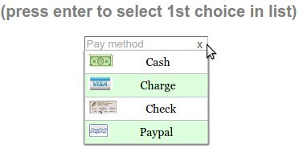

Parameters specifications for select lists
==========================================

`Show me the select demo <http://www.menuoptions.org/examples/SelectWithImages.html>`_

Parameter list for select list
-------------------------------

.. csv-table:: Paramters for select list
    :header: Parameter,Type,Allowable Values,Default,Required
    :widths: 22,22,35,35,25

    ClearBtn,boolean,"true or false",true,false
    ColumnCount,integer,"positive integer",1,false
    Data,JSON object, (see Data section below), none, true
    DisableHiLiting,boolean, "true or false", false, false
    Filters, array of objects,"{'str':'str'} or {'str':'RegExp'}", none, false
    MenuOptionsType,string,'Select' or 'Navigate','Select',false
    onSelect, function,function(),none,false
    PlaceHolder,"placeholder (HTML5)",text,none,false
    SelectOnly,boolean,"true or false",false,false
    ShowAt,string,'Bottom' or 'Right','Bottom',false
    Sort,array of strings,"['alpha'|'num', 'desc'|'asc']","['alpha','asc']",false
    TriggerEvent, <deleted>,<as of v1.5.1>,--,--
    UseValueForKey,boolean,"true or false",false,false
    Width,integer,positive integer, width of parent, false

Parameters explained for MenuOption select
------------------------------------------

ClearBtn
^^^^^^^^
    options: **true or false**

    ClearBtn instructs MenuOptions to place a clear button to the right
    of the input element. It will clear that input element when clicked
    and cause the drop down list to appear.

ColumnCount
^^^^^^^^^^^
   options: **positive integer**

   MenuOptions defaults to a single column. To show have more than one 
   column, use the ColumnCount parameter. 

Data
^^^^
    options: **[] or [ [], [], ...], {} or [ {}, {}, ... ]** 

    MenuOptions accepts the following in `Data`

    1. an array
    2. an array of arrays
    3. a single object
    4. an array of objects

DisableHiLiting
^^^^^^^^^^^^^^^
    options: **true or false**

    When using autocomplete, if the user typed text does not match a `whole` select item,
    the border will be set to red. Once there is a match, the border returns to 
    its default color. Set to true to disable this feature. 
    
Filters
^^^^^^^
    options: **[ { 'text : 'text' }, ...] or [ {'text': 'RegExp'}, ...]**

    Filters enable mouseover filtering of select items
    You can filter by plain text or by regular expression
    Here is an example of using Filters with a RegExp
    (`see a demo <http://www.menuoptions.org/examples/MenusBottom.html>`_ )

.. code-block:: html

    'Filters': [{ 'Biz' : '^(CNBC|MarketWatch)'}, {'Search' :'^(Google|Yahoo)'} ],

MenuOptionsType
^^^^^^^^^^^^^^^
    options: **'Select' or 'Navigate'**

    MenuOptions defaults to "Select". To create a menu drop down, call 
    menuoptions with MenuOptionsType = "Navigate"

.. code-block:: javascript

    'MenuOptionsType': 'Navigate'

onSelect
^^^^^^^^
    options: **function(<MenuOptions instance>, data)**  

    When user selects an option, either by clicking or by pressing enter while
    in the text box, this function will be executed

    data has 3 values

     1. newVal (the new value that was selected)
     2. newCode (the code that corresponds to new value that was selected)
     3. type (this tells you if the selection was made by "Click" or "EnterKey")

.. code-block:: javascript

    "onSelect": function(mo, data) { 
        if ( data.type == "EnterKey" ) {
            $("form#tst").submit();
        }
        console.log(mo, data.newVal, data.newCode, data.type ); 
    }, 

PlaceHolder
^^^^^^^^^^^
    options: **'placeholder text'**

    PlaceHolder enables placeholder text (HTML5) to be inserted into 
    input=text element

Sort
^^^^
    options: **['alpha' or 'num', 'desc' or 'asc']**

    Setting the property to an empty array will cause a Data array 
    (or array of objects) to be displayed in the original order.
    With no sort, a single object will be displayed in random order.

SelectOnly
^^^^^^^^^^
    options: **true or false**

    This makes the input element read-only, i.e., data can only be entered 
    by clicking a select item (note: this prevents the use of autocomplete).

ShowAt
^^^^^^
    options: **'bottom' or 'right'**  

    MenuOptions accepts a string to tell it where to display the select items ::

    "Bottom" means that the select list will appear underneath
    "Right" means that the select list will appear to the right

UseValueForKey
^^^^^^^^^^^^^^
    options: **true or false**

    UseValueForKey = true means that the visible option will be the same as the 
    `menu_opt_key`. So if the visible option were "CA", the html built would look
    like:

.. code-block:: html

    <td menu_opt_key"CA">"CA"</td>. 

Width
^^^^^
   options: **positive integer**

   MenuOptions will try to match the width of the parent element (it may be
   wider if the contents cannot fit). The Width parameter allows the user to 
   override the default width. 

