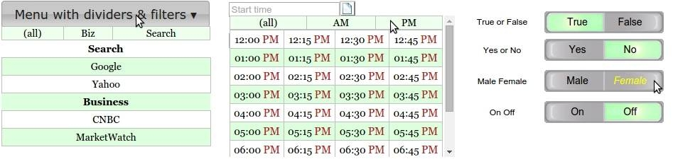

.. MenuOptions documentation master file, created by
   sphinx-quickstart on Sat Oct 25 22:36:22 2014.
   You can adapt this file completely to your liking, but it should at least
   contain the root `toctree` directive.

Welcome to MenuOptions
=====================================================

MenuOptions was created for one reason:
---------------------------------------

To reduce - `to an absolute minimum` - the # of keystrokes and clicks required for data entry & navigation.

What it looks like:
-------------------

Benefits:

- 1 click data entry

- it uses intelligent autocomplete (characters not in any select list item 
  are automatically removed, saving keystrokes)
  can utilize multicolumn select lists.

- mouseover filtering lets user reduce choices by moving their mouse over a filter element

- mulitcolumn display of choices, allowing more data to be presented at one time

- has a rocker control, convenient for binary choices (true/false, yes/no, etc)

- uses scrolling to accomodate large lists

Other benefits:

- uses color highlighting to show autocomplete matches

- it can utilize data from a variety of JSON types (array, array of arrays, 
  single object, array of objects)

- the value associated with with the label string is saved in the input element 
  automatically (in the menu_opt_key - no need to manually update a hidden field)

- since the dropdowns uses similar logic to menus, it has a basic menu system thrown in.

- tested on Win 8.1 IE10 and Safari 5.17, on Ubuntu Chrome 41.0.2272 and Firefox 37.0

- has a suite of 17 automated tests

Prerequisites:
--------------

- jQuery version >=1.9
- jQuery ui version >= 1.10
- download `MenuOptions from git <https://github.com/compsult/MenuOptions>`_
- download `MenuOptions from npm <https://www.npmjs.com/package/menuoptions>`_

See the live examples
---------------------
`at MenuOptions.org <http://www.menuoptions.org>`_

Contents:

.. toctree::
   :maxdepth: 3

   QuickStart
   MenuParams
   SelectParams
   UserMethods
   Serialize
   Dividers
   Filters
   FAQ

   

Indices and tables
==================

* :ref:`genindex`
* :ref:`modindex`
* :ref:`search`

